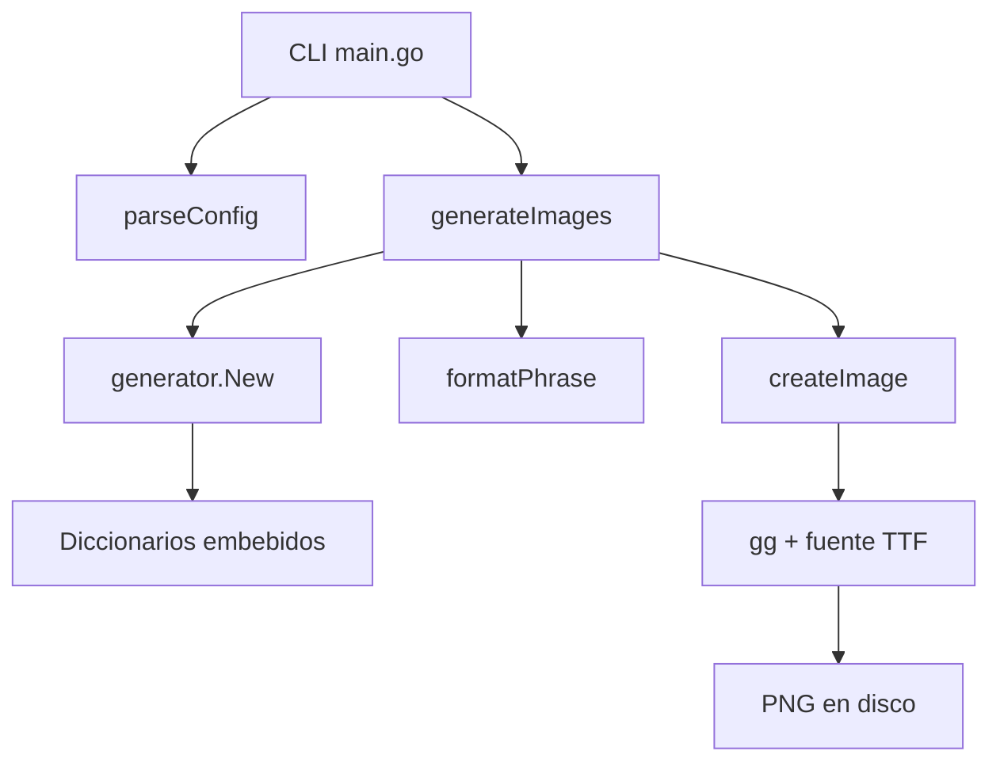

# Go Generator Phrases

Aplicacion CLI en Go que genera frases aleatorias y las renderiza como imagenes PNG.

El proyecto esta dividido en dos partes:
- Un binario principal que procesa argumentos, formatea el texto y genera las imagenes.
- Un subpaquete generador que carga diccionarios embebidos con `embed` y construye frases aleatorias.

## Caracteristicas

- Generacion de imagenes PNG a partir de frases aleatorias.
- Diccionarios embebidos en el binario, sin dependencia de rutas externas en runtime.
- CLI simple con flags y compatibilidad con cantidad posicional.
- Ajuste automatico del tamano de fuente para evitar desbordes horizontales y verticales.
- Pruebas unitarias para CLI, formateo y generacion.

## Requisitos

- Go 1.22 o superior.
- Fuente TTF disponible en `fonts/`.

## Instalacion

```bash
git clone https://github.com/yorologo/go-generator-phrases.git
cd go-generator-phrases
go mod download
```

## Uso rapido

```bash
go run .
go run . 5
go run . -n 3 -out out
```

Salida por defecto:
- Directorio: `img/`
- Prefijo: `img`
- Resultado: `img/img1.png`, `img/img2.png`, etc.

## Flags disponibles

| Flag | Descripcion | Valor por defecto |
| --- | --- | --- |
| `-n` | Cantidad de imagenes a generar | `1` |
| `-out` | Directorio de salida | `img` |
| `-prefix` | Prefijo del nombre del archivo | `img` |
| `-width` | Ancho de la imagen en pixeles | `1200` |
| `-height` | Alto de la imagen en pixeles | `300` |
| `-font` | Ruta del archivo `.ttf` | `fonts/SedanSC-Regular.ttf` |

## Ejemplos

Generar una sola imagen:

```bash
go run .
```

Generar cinco imagenes:

```bash
go run . 5
```

Cambiar directorio de salida y prefijo:

```bash
go run . -n 4 -out renders -prefix frase-
```

Cambiar dimensiones y fuente:

```bash
go run . -n 2 -width 1600 -height 500 -font fonts/Roboto-Regular.ttf
```

## Arquitectura



## Estructura del proyecto

```text
.
|-- fonts/
|   |-- Roboto-Regular.ttf
|   `-- SedanSC-Regular.ttf
|-- go-generator-phrases/
|   |-- dictionaries/
|   |   |-- auxiliaries.txt
|   |   `-- phrases.txt
|   |-- generator.go
|   `-- generator_test.go
|-- main.go
|-- main_test.go
|-- go.mod
`-- README.md
```

## Flujo interno

1. `main.go` valida los argumentos de entrada.
2. El paquete `go-generator-phrases` carga diccionarios desde archivos embebidos.
3. Se genera una frase aleatoria sustituyendo los marcadores `-` por auxiliares aleatorios.
4. La frase se formatea para mejorar su presentacion.
5. Se crea una imagen PNG y se ajusta la fuente al espacio disponible.

## Desarrollo

Ejecutar pruebas:

```bash
go test ./...
```

Formatear codigo:

```bash
gofmt -w .
```

## Detalles tecnicos

- El subpaquete generador usa `embed` para empaquetar los diccionarios en el binario.
- El renderizado usa [`github.com/fogleman/gg`](https://github.com/fogleman/gg).
- El tamano de fuente se reduce progresivamente hasta que el contenido cabe dentro del canvas.
- El directorio de salida se crea automaticamente si no existe.

## Posibles mejoras futuras

- Exportar tambien a JPG o WebP.
- Permitir colores, temas y fondos personalizados.
- Exponer una API HTTP ademas de la CLI.
- Permitir diccionarios externos por bandera sin recompilar.

## Estado actual

Validado con:

```bash
go test ./...
```
