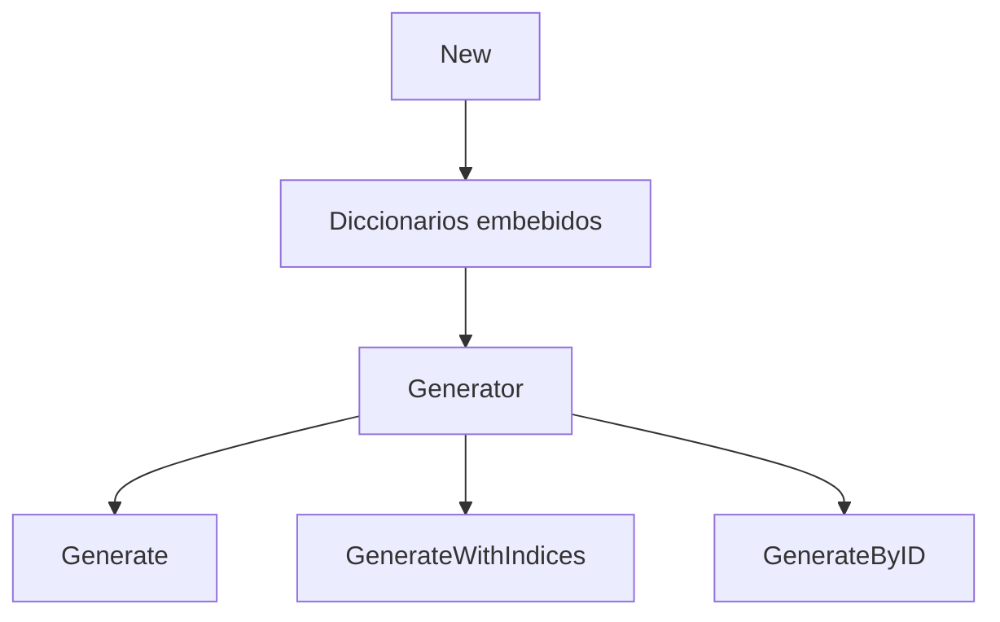

# Go Generator Phrases

Biblioteca en Go para generar frases aleatorias a partir de plantillas y auxiliares en espanol.

La rama `main` mantiene el objetivo de libreria reusable. No expone servidor HTTP ni CLI: solo la API del generador.

## Caracteristicas

- Generacion aleatoria de frases a partir de diccionarios.
- Reconstruccion exacta de frases mediante indices.
- Diccionarios embebidos con `embed`, sin dependencia de rutas del sistema de archivos.
- API pequena y estable para integracion en otras aplicaciones Go.
- Pruebas unitarias para generacion, reconstruccion y validaciones.

## Requisitos

- Go 1.16 o superior.

## Instalacion

```bash
go get github.com/yorologo/go-generator-phrases
```

## Uso

```go
package main

import (
    "fmt"

    generator "github.com/yorologo/go-generator-phrases"
)

func main() {
    gen, err := generator.New()
    if err != nil {
        panic(err)
    }

    phrase, phraseIndex, auxiliaryIndices, err := gen.GenerateWithIndices()
    if err != nil {
        panic(err)
    }

    rebuilt, err := gen.GenerateByID(phraseIndex, auxiliaryIndices)
    if err != nil {
        panic(err)
    }

    fmt.Println(phrase)
    fmt.Println(rebuilt)
}
```

## API

### `New() (Generator, error)`

Carga los diccionarios embebidos y devuelve una instancia lista para generar frases.

### `Generate() (string, error)`

Devuelve una frase aleatoria.

### `GenerateWithIndices() (string, int, []int, error)`

Devuelve una frase aleatoria junto con:
- el indice de la plantilla seleccionada;
- los indices de auxiliares usados.

### `GenerateByID(phraseIndex int, auxiliaryIndices []int) (string, error)`

Reconstruye exactamente una frase usando los indices entregados previamente.

## Arquitectura



## Desarrollo

Ejecutar pruebas:

```bash
go test ./...
```

## Notas

- Los diccionarios actuales generan frases en espanol.
- Los espacios repetidos se compactan antes de devolver el resultado.
- `GenerateByID` valida cantidad e indices de auxiliares para evitar reconstrucciones inconsistentes.
